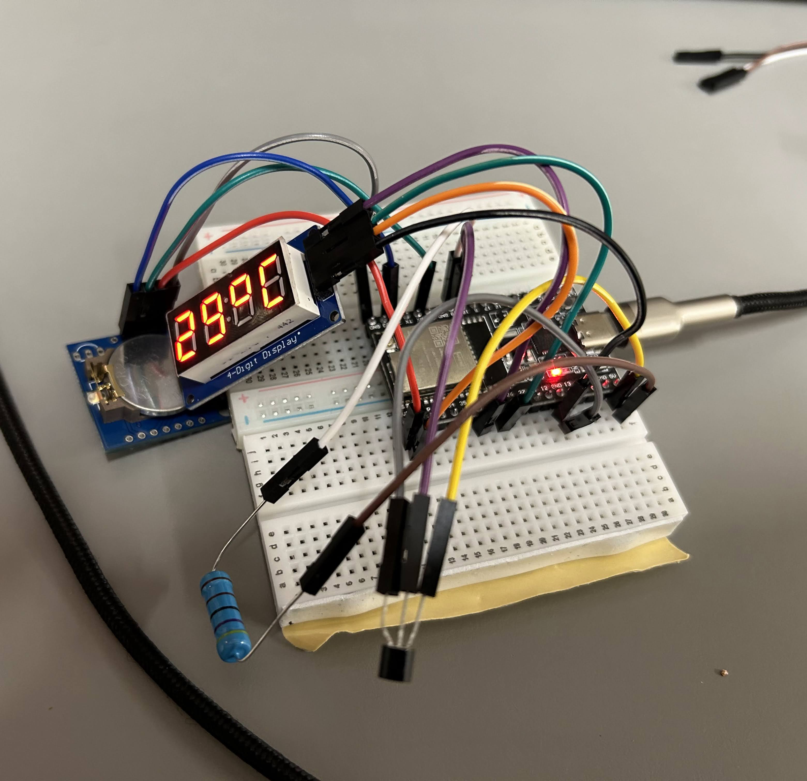
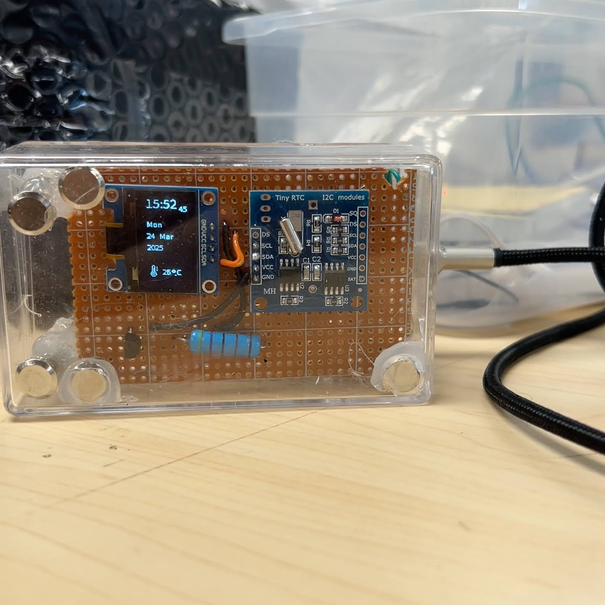
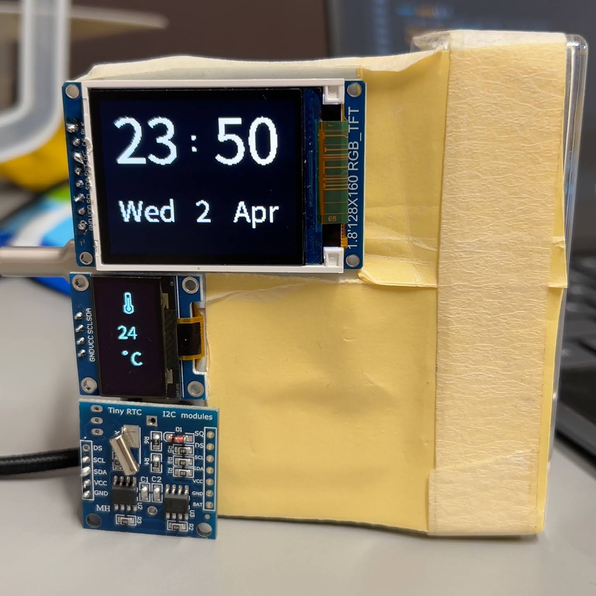
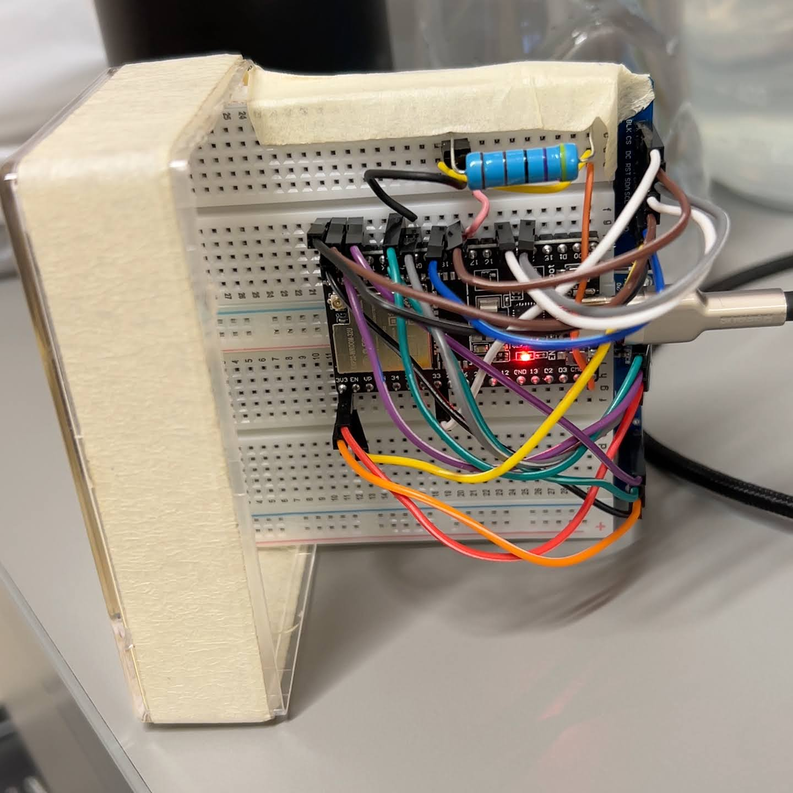

# Table clock with ESP32
RTC module DS1307 is used to keep track of the time.

### Working prototype with TM1637 display:

### Working prototype with SSD1306 display:

### Working prototype with ST7736 1.8in display and SSD1306 display:
Completed prototype\

